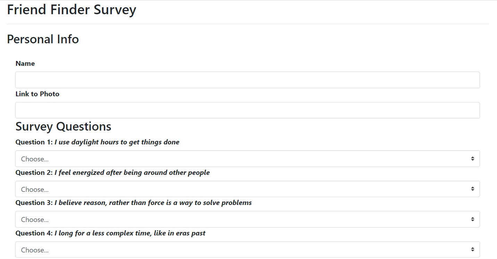

# Friend Finder

### Overview

Friend Finder is an app deployed to Heroku that allows a user to answer a short survey and be paired with a person that matched their answers most closely.  

### Use

From the home page the user can navigate to the survey page, fill out their name, add a link to an image of themselves and answer 10 questions from 1-Strongly Disagree to 5-Strongly Agree.  If the user does not fill out the name, image input or any of the ten questions the survey will not submit.  Once the everything has been filled out properly, the Friend Finder algorythm will match with the friend that most closely matched the answers of the user.  That friend's name and picture will appear in a modal.  The user will then be navigated back to the home page.

When each new user fills out the survey they are added to the list of Friends for future users to match with.  They are stored as JSON objects on a separate page that can be reached at https://enigmatic-forest-48950.herokuapp.com/api/friends. This page can also be reached by a link on the home page.

### [Link to app page](https://enigmatic-forest-48950.herokuapp.com/home)